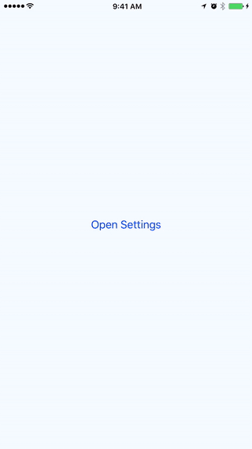

# react-native-settings


## Getting started

`$ npm install react-native-settings --save`

### Mostly automatic installation

`$ react-native link react-native-settings`

### Manual installation


#### iOS

1. In XCode, in the project navigator, right click `Libraries` ➜ `Add Files to [your project's name]`
2. Go to `node_modules` ➜ `react-native-settings` and add `OpenAppSettings.xcodeproj`
3. In XCode, in the project navigator, select your project. Add `libRNOpenAppSettings.a` to your project's `Build Phases` ➜ `Link Binary With Libraries`
4. Run your project (`Cmd+R`)<

#### Android

1. Open up `android/app/src/main/java/[...]/MainActivity.java`
  - Add `import com.krazylabs.OpenAppSettingsPackage;` to the imports at the top of the file
  - Add `new OpenAppSettingsPackage()` to the list returned by the `getPackages()` method
2. Append the following lines to `android/settings.gradle`:
  	```
  	include ':react-native-settings'
  	project(':react-native-settings').projectDir = new File(rootProject.projectDir,'../node_modules/react-native-settings/android')
  	```
3. Insert the following lines inside the dependencies block in `android/app/build.gradle`:
  	```
      compile project(':react-native-settings')
  	```


## Usage
```javascript
import OpenAppSettings from 'react-native-settings'

OpenAppSettings.open()
```
  